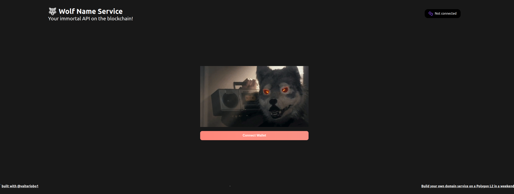

# Wolf Name Service

Bootcamp Build your own domain service on a Polygon L2 in a weekend


https://buildspace.so/p/build-polygon-ens


### Hardhat tasks :
```shell
npx hardhat help
npx hardhat test
GAS_REPORT=true npx hardhat test
npx hardhat node
npx hardhat run scripts/deploy.js
```

https://www.testnets.dev/
